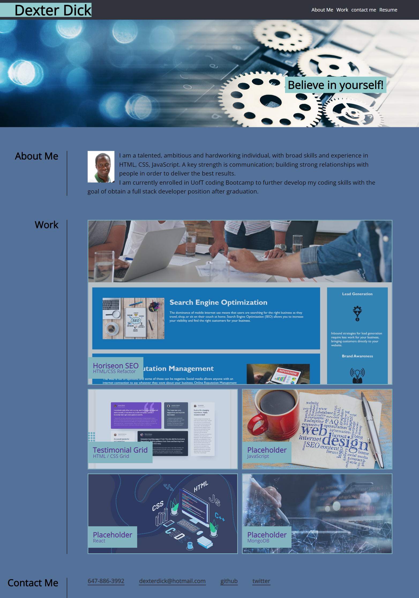

# Dexter's Protfolio

## Description

The motivation for building this project was to shocase my skills as a full stack developer. This project makes it easy for employers to view my work online and contact me for jobs.

Some of the skills showcased include:

- HTML
- CSS
- Flexbox
- CSS Grid layout.

The project uses media queries to allow web page design and layout to automatically adapt to any screen size. I also added descriptive alt tags for images to enable screen readers to read the information about the image to help users who may be visually impaired or not able to view images on the page.

The project uses Semantic HTML to help screen readers, and other user devices determine the significance and context of web content to help users with accessibility needs.

I enjoyed building this personal portfolio and will continue to update the project with skills and projects.

[Dexter's Portfolio URL: ](https://dexterdick.github.io/Dexter-Portfolio/)

[Github repository](https://github.com/DexterDick/Dexter-Portfolio)

## Screenshots

The following image shows the web website appearance. on large screen.
;

The following image shows the web website appearance. on laptop screen.
;

The following image shows the web website appearance. on small screen 375px.
;
